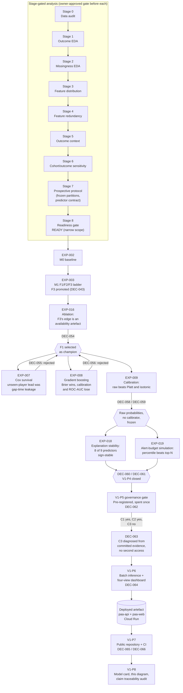

# Architecture

Two views. The first is the data and serving path: where a byte enters the
system and how it becomes a number on the dashboard. The second is the
evidence chain: how a stage-gated analysis programme became a champion
model, a set of governing decisions, and a deployed artefact.

## Data and serving path

```mermaid
flowchart LR
    subgraph Source
        Z["SoccerMon archive\n(Zenodo, ~99 GB compressed)"]
    end

    subgraph GCS["Cloud Storage: paa-data / paa-source-archives"]
        RAW["raw/"]
        BRONZE["bronze/\n(deterministic parsing)"]
        SILVER["silver/\n(registry, wellness, load,\nsessions, injury episodes)"]
        GOLD["gold/\n(player_day_features.parquet,\nplayer_day_labels.parquet)"]
    end

    BQPROV[("BigQuery paa_core\ningestion_runs, source_files")]

    subgraph Product["V1-P6 batch inference (jobs/product/run_batch_inference.py)"]
        FIT["Fit frozen F1 champion\non development partition"]
        SCORE["Score every eligible\nplayer-day"]
        RECON["Reconcile BQ-bound and\nartefact-bound rows"]
    end

    BQPRODUCT[("BigQuery paa_product\ntable of record")]
    ARTEFACT["GCS serving artefact\nparquet + manifest +\nonset calendar"]

    API["paa-api (Cloud Run)\nFastAPI, reads artefact only,\nnever queries BigQuery per request"]
    WEB["paa-web (Cloud Run)\nNext.js, four views,\nBasic-Auth gated"]
    REVIEWER(["Reviewer"])

    Z --> RAW --> BRONZE --> SILVER --> GOLD
    BRONZE -.provenance.-> BQPROV
    GOLD --> FIT --> SCORE --> RECON
    RECON --> BQPRODUCT
    RECON --> ARTEFACT
    ARTEFACT --> API
    API -->|"IAM-authenticated,\nsame-project identity"| WEB
    WEB --> REVIEWER
```

The API never queries BigQuery per request; `paa_product` is the table of
record and reconciliation target, not the serving path. The two Cloud Run
services communicate over IAM identity (`run.invoker` restricted to the web
service's own service account), not network-level ingress restriction —
this project provisions no Direct VPC egress, so IAM authentication is what
actually enforces "reachable only by this identity" (`DEC-064`).

## Evidence chain: analysis to deployed artefact

Every arrow into a decision node (`DEC-###`) is backed by a committed
evidence table under `outputs/`; see
[`CLAIM_TRACEABILITY.md`](CLAIM_TRACEABILITY.md) for the claim-by-claim
mapping and [`DECISION_LOG.md`](DECISION_LOG.md) for the full record.
