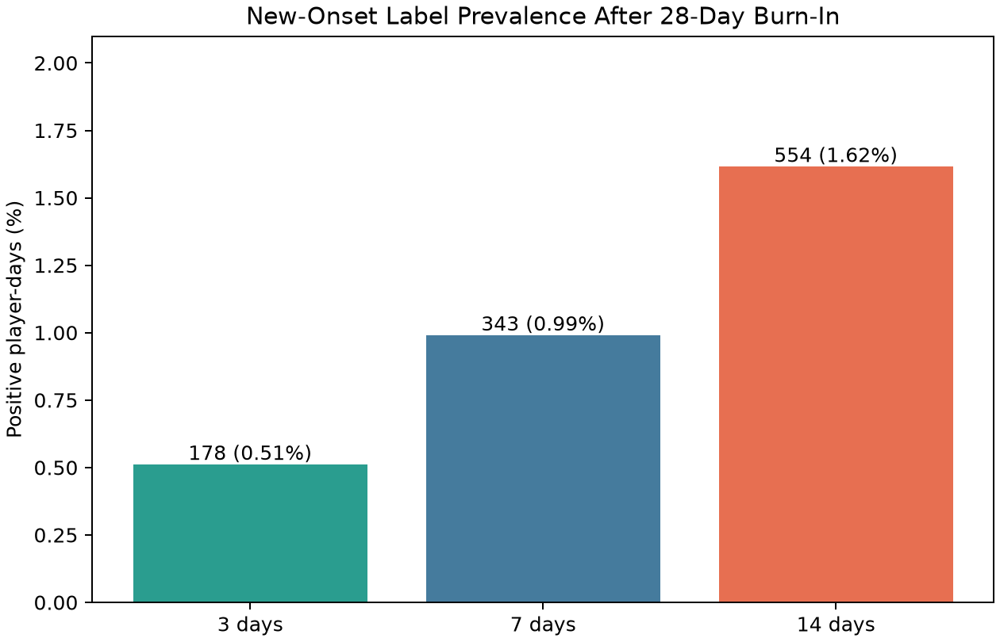
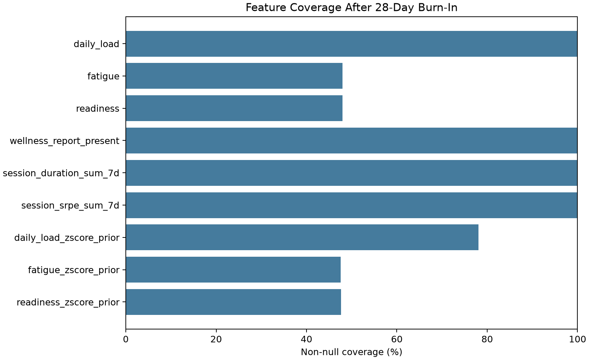
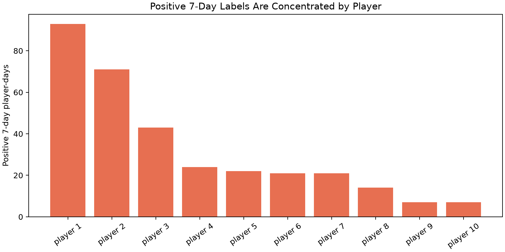

# Phase A - Subjective Cohort, Outcome and Feature Quality Report

## Scope

This report is descriptive model-readiness analysis for the `subjective_v1` player-day product. It does not fit or evaluate a predictive model. Its purpose is to verify cohort size, outcome prevalence, episode concentration and predictor availability before chronological split selection.

## Dataset Snapshot

- Observation window: `2020-01-01` to `2021-12-31`.
- Observed player-days: `36,550`.
- Players: `50` across `2` teams.
- Burn-in rule for headline analysis: first 27 calendar days per player excluded from the 28-day-feature cohort.
- Outcome: future self-reported injury-episode start; same-day episodes are excluded from future labels under the accepted end-of-day cutoff.

## Figures

## Cohort Flow and Label Prevalence

| Horizon | Complete-label rows | 28-day-history and new-onset eligible rows | Positive player-days | Prevalence |
|---:|---:|---:|---:|---:|
| 3 days | 36,400 | 34,849 | 178 | 0.51% |
| 7 days | 36,200 | 34,649 | 343 | 0.99% |
| 14 days | 35,850 | 34,299 | 554 | 1.62% |

Interpretation: a positive player-day is not an independent medically verified injury. Several days can precede the same episode, which is expected for overlapping fixed-horizon labels.

## Episode Construction Summary

- Raw injury reports: `162`.
- Primary 3-day-gap self-reported episodes: `147`.
- Raw reports per episode: `1.1`.
- Players with at least one episode: `15`.
- Episode duration: median `0.0` days; maximum `23` days.

## Predictor Coverage After Burn-In

| Predictor | Non-null rows | Coverage |
|---|---:|---:|
| daily_load | 35,200 | 100.00% |
| fatigue | 16,890 | 47.98% |
| readiness | 16,896 | 48.00% |
| wellness_report_present | 35,200 | 100.00% |
| session_duration_sum_7d | 35,200 | 100.00% |
| session_srpe_sum_7d | 35,200 | 100.00% |
| daily_load_zscore_prior | 27,471 | 78.04% |
| fatigue_zscore_prior | 16,732 | 47.53% |
| readiness_zscore_prior | 16,781 | 47.67% |

`wellness_report_present` is a process/completeness field. Any predictive value must be interpreted as potentially reflecting reporting behaviour rather than physiology.

## 7-Day Positive-Label Concentration

| Player | Team | Positive player-days |
|---|---|---:|
| TeamA-4051bba7-1170-4c43-b912-8c38815a7625 | TeamA | 93 |
| TeamA-3e5f6e2b-46b7-4890-84a9-3bbb2649af5a | TeamA | 71 |
| TeamA-5cd7a61b-88b2-46d2-94f8-5a0d4f682d93 | TeamA | 43 |
| TeamA-c4ccf1a6-48c3-4a17-8d6c-eedd12e8680e | TeamA | 24 |
| TeamA-bcc03f81-2733-45d3-abf1-f7a709c63e68 | TeamA | 22 |
| TeamA-560cb066-a8ae-412f-b09f-0d2a6aa0cf05 | TeamA | 21 |
| TeamA-74afe68c-f348-414c-9754-6d6f9df12587 | TeamA | 21 |
| TeamA-5a5b135d-d146-4b4c-b3da-efcd4d203f95 | TeamA | 14 |
| TeamA-b58af410-da77-479e-b93c-e03617b9f36d | TeamA | 7 |
| TeamA-affd6f1d-b364-4700-98bf-8f20896e5ac4 | TeamA | 7 |

Concentration is reported before fitting because repeated player-days are dependent. Later uncertainty intervals must be clustered by player, and leave-one-player-out analysis is mandatory before generalisation claims.

## Descriptive 7-Day Associations

These univariate Pearson correlations are descriptive only. They are not feature-selection evidence, causal evidence or model performance. They use the 28-day-history, new-onset-eligible cohort and are included to detect extreme or surprising associations before fitting.

| Predictor | Correlation with 7-day label |
|---|---:|
| readiness | -0.0919 |
| session_duration_sum_7d | 0.0326 |
| session_srpe_sum_7d | 0.0306 |
| wellness_report_present | 0.0224 |
| fatigue_zscore_prior | 0.0224 |
| daily_load | 0.0182 |
| daily_load_zscore_prior | 0.0155 |
| fatigue | -0.0146 |
| readiness_zscore_prior | -0.0127 |

## Phase A Decision

**PROMOTE to Phase B.** The cohort, censored labels and feature product are available for chronological split construction. No model conclusion is made in this report. Before fitting EXP-002, freeze date boundaries, implement a predictor allow-list and verify that preprocessing is fit only on the training partition.

## Limitations

- Labels describe self-reported injury-related episodes, not clinical diagnoses.
- Fixed-horizon positive player-days overlap by construction.
- The modest number of episodes and player-level dependence limit precision.
- Descriptive association cannot establish that load, wellness or missingness caused an event.
