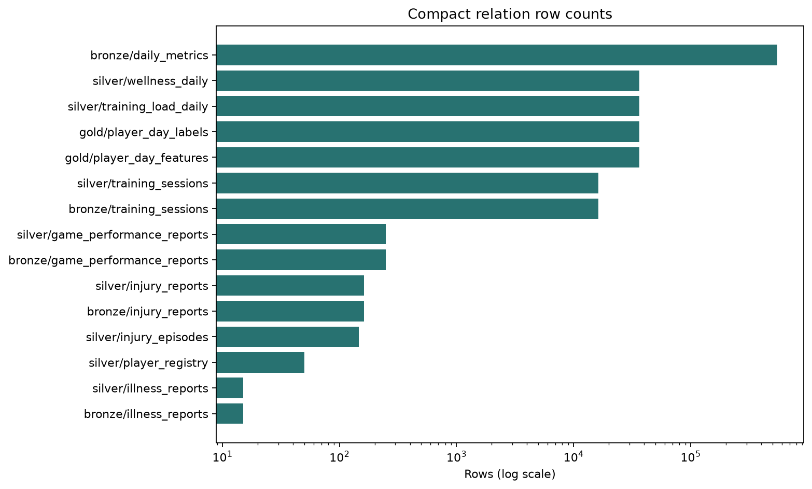
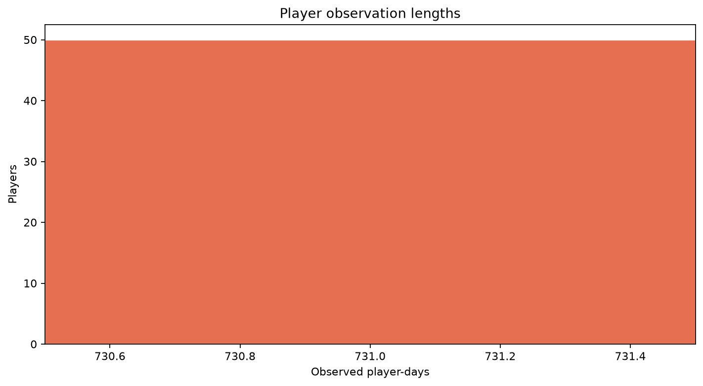
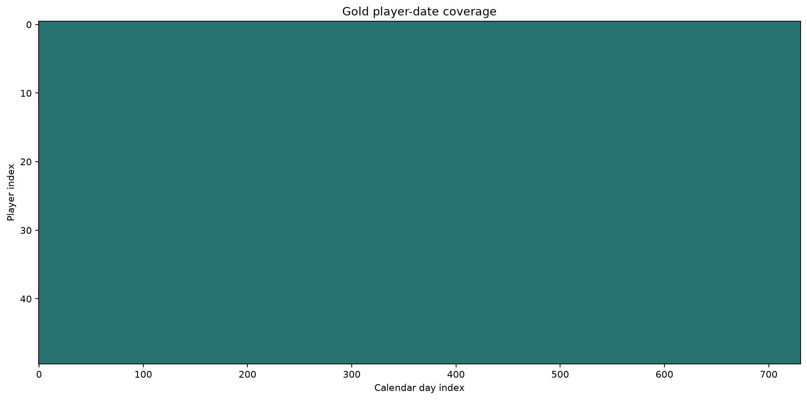

# Stage 0 - Data Inventory and Audit

## Decision Status

Automated audit result: **PASS**. This is a data-foundation gate, not EDA or model evidence.

## Scope

- Compact relations audited: `15`.
- GCS objects inventoried: `45`.
- Failures: `0`; warnings: `1`.
- No outcome prevalence, feature distribution, correlation, split or model analysis was performed.

## Findings

| Check | Scope | Status | Message |
|---|---|---|---|
| episode_date_order | silver.injury_episodes | PASS | 0 episodes end before they start |
| gold_calendar_continuity | gold.player_day_labels | PASS | 0 missing player-days inside observed spans |
| layer_reconciliation | all layers | PASS | 0 reconciliation failures |
| primary_keys | all relations | PASS | 0 relation key failures |
| registry_date_order | silver.player_registry | PASS | 0 players end before they start |
| schema_contracts | all relations | PASS | 0 schema mismatches |
| session_dates_are_sparse | bronze/silver training sessions | WARNING | Session relations are event-grain and naturally have sparse dates; aggregate span gap count is 21722 |

## Figures

## Gate

A project-owner review is required even when automated checks pass. Stage 1 must not begin until this report and its tables are discussed and approved.
