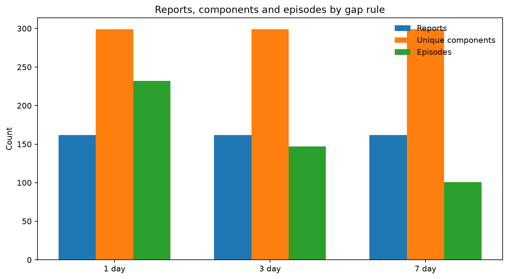
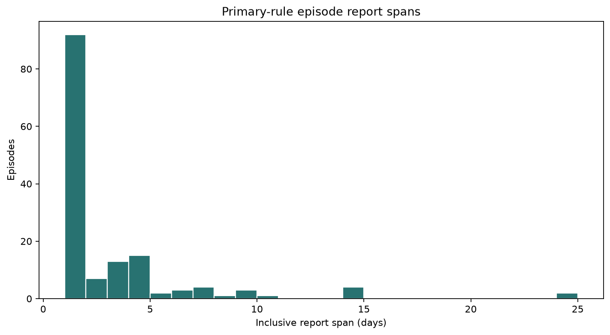
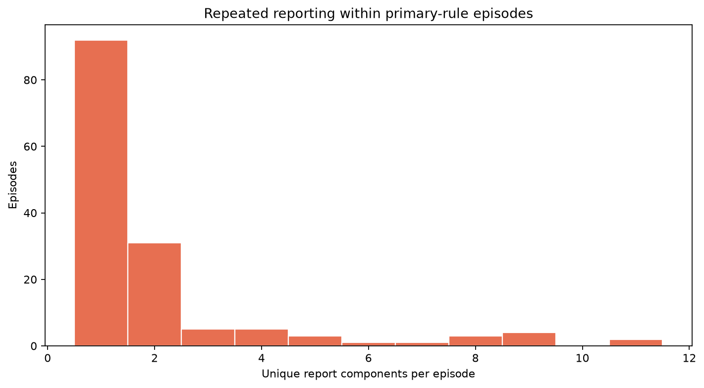
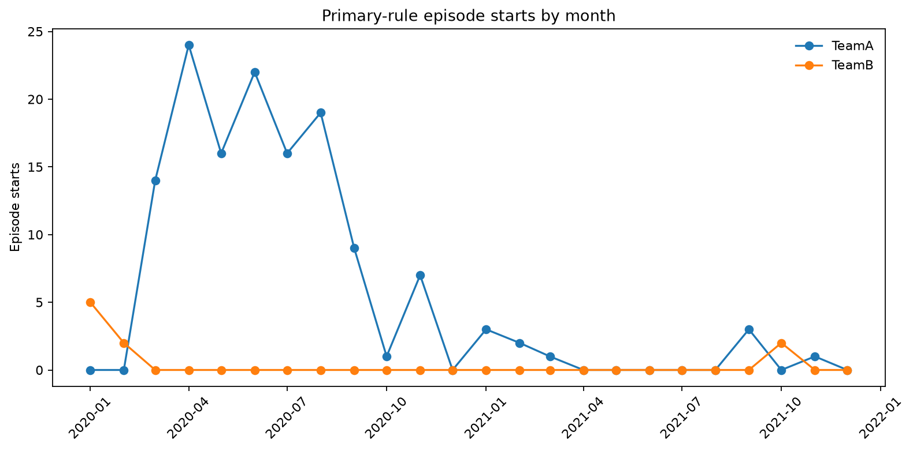
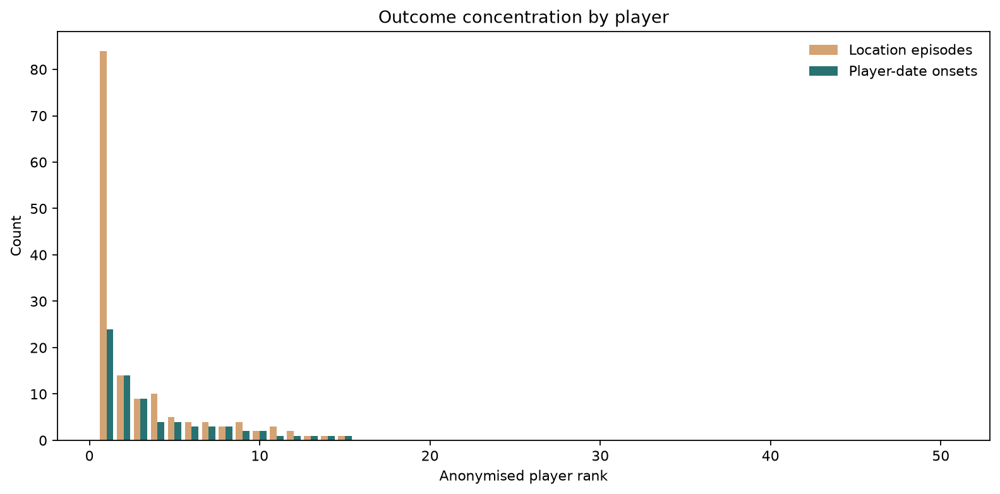
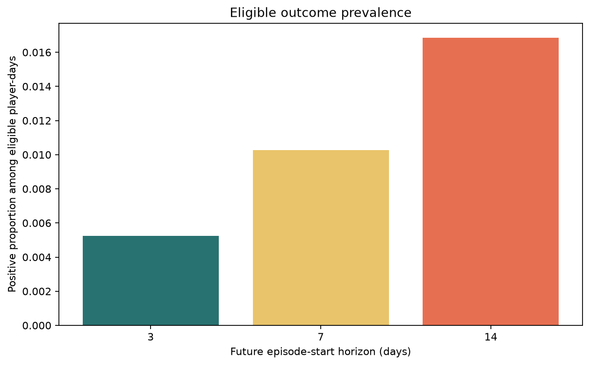
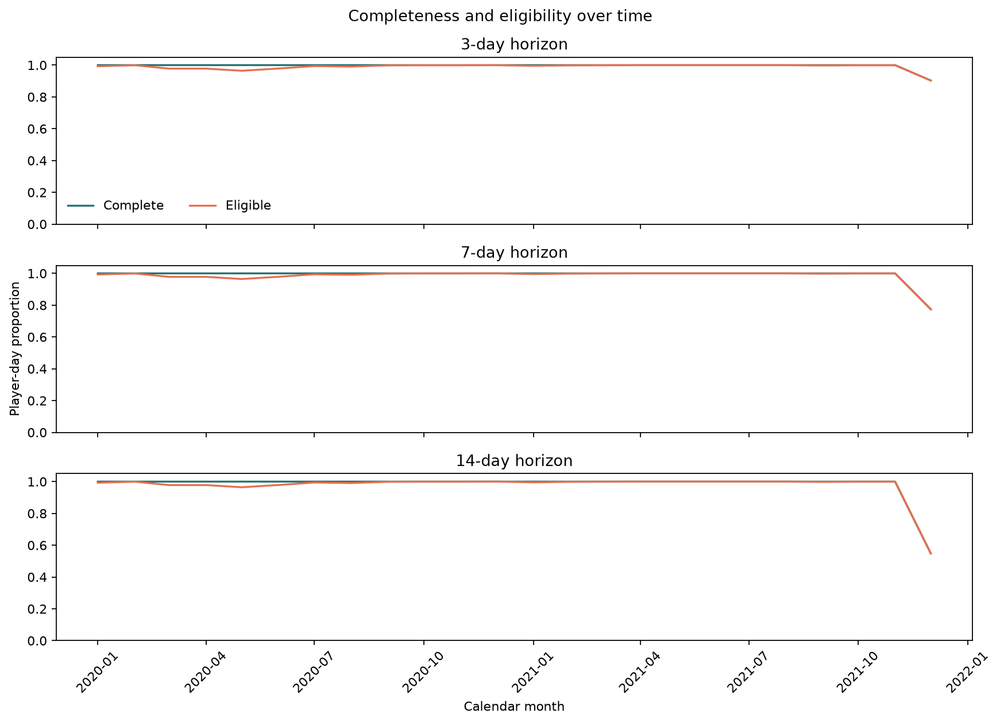
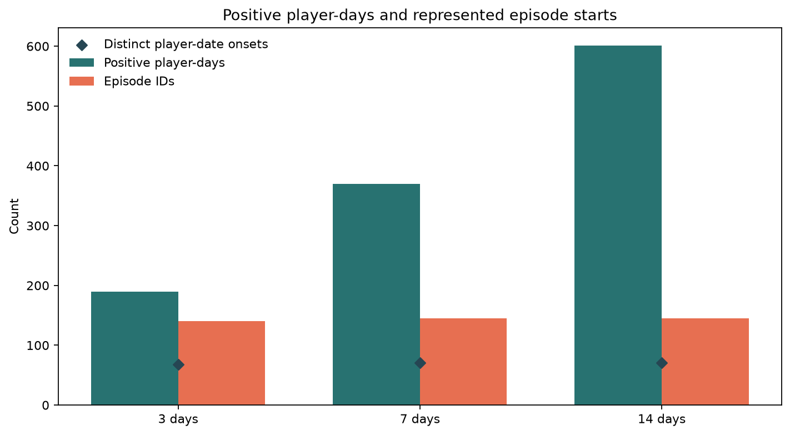

# Stage 1 - Injury Episode and Outcome EDA

## Automated Status

Automated outcome-integrity result: **PASS**. 
Project-owner review is still required before Stage 2.

## Scope and Semantics

- Source injury reports: `162`.
- Parsed components: `306`; unique components: `299`.
- Primary three-day-rule episodes: `147`.
- Distinct primary player-date onset events: `73`.
- Episode duration means inclusive first-to-last report span. It is not absence, recovery or return-to-play duration.
- Outcomes describe future self-reported injury-related episode starts, not diagnoses.

## Gap Sensitivity

| Gap days | Episodes | Onset days | Multi-location onset days | Median span | Maximum span |
|---:|---:|---:|---:|---:|---:|
| 1 | 232 | 108 | 56 | 1.0 | 8 |
| 3 | 147 | 73 | 33 | 1.0 | 24 |
| 7 | 101 | 55 | 18 | 1.0 | 103 |

## Label Denominators

| Horizon | Complete days | Eligible days | Eligible positives | Prevalence | Episode IDs | Onset days |
|---:|---:|---:|---:|---:|---:|---:|
| 3 | 36400 | 36192 | 190 | 0.525% | 140 | 68 |
| 7 | 36200 | 35992 | 370 | 1.028% | 145 | 71 |
| 14 | 35850 | 35642 | 601 | 1.686% | 145 | 71 |

## Analytical Interpretation

- The three-day rule is an intermediate sensitivity choice: the one-day rule fragments reports, while the seven-day rule can produce report spans exceeding three months.
- The 147 location episodes reduce to 73 distinct player-date onset events; the leading player contributes 32.9% of onset events.
- The leading team contributes 90.4% of onset events, so team-transfer claims would be unsupported without explicit stress testing.
- Automated PASS establishes reproducibility and internal label integrity. It does not establish sufficient event support, generalisability or predictive value.

## Findings

| Check | Scope | Status | Message |
|---|---|---|---|
| primary_episode_reproduction | three-day episode rule | PASS | Stored episodes reproduce exactly |
| episode_date_order | primary episodes | PASS | 0 episodes end before they start |
| component_conservation | all gap rules | PASS | 0 gap rules fail unique-component conservation |
| gold_label_reproduction | gold player-day labels | PASS | 0 fields differ from independently rebuilt labels |
| horizon_nesting | 3/7/14-day labels | PASS | 0 positive-label nesting violations |
| episode_gap_sensitivity | 1/3/7-day rules | REVIEW | Episode counts by increasing gap rule: [232, 147, 101] |
| event_concentration | players | REVIEW | 35 players have no episodes; top five onset-day share is 75.3% |
| simultaneous_location_starts | primary episodes | REVIEW | 33 player-date onsets contain multiple location episodes |
| report_span_interpretation | episode characteristics | REVIEW | Episode span measures first-to-last report dates, not medical absence duration |

## Figures

## Gate

Approve or revise the primary episode rule and outcome-label credibility. No predictor analysis or modelling decision is made in this stage.
