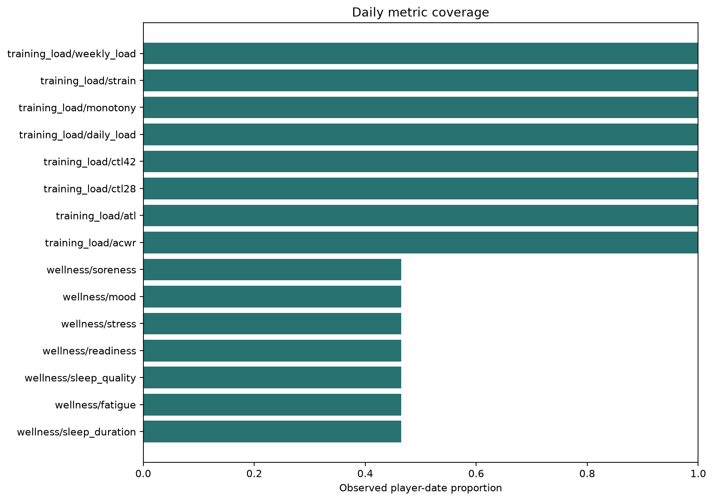
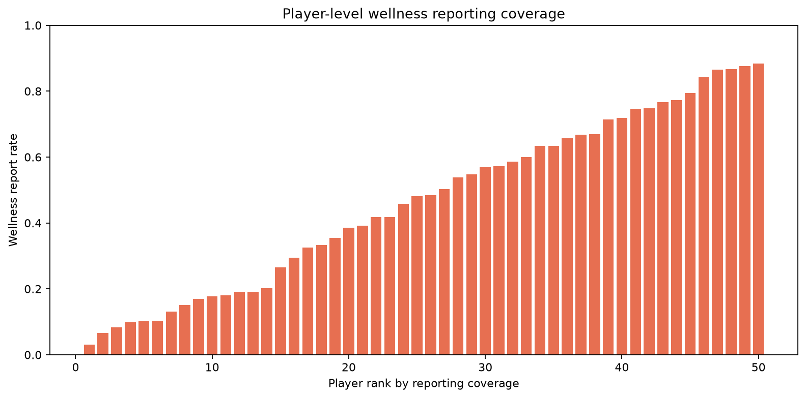
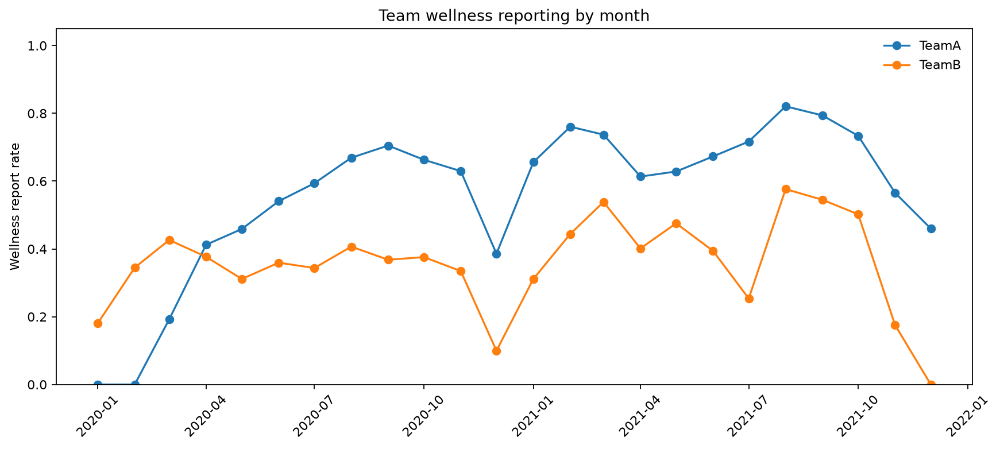
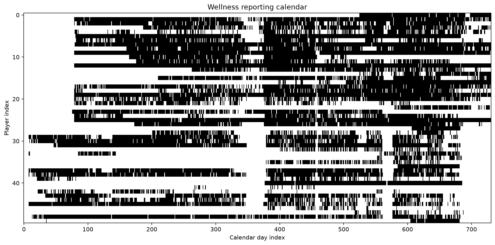
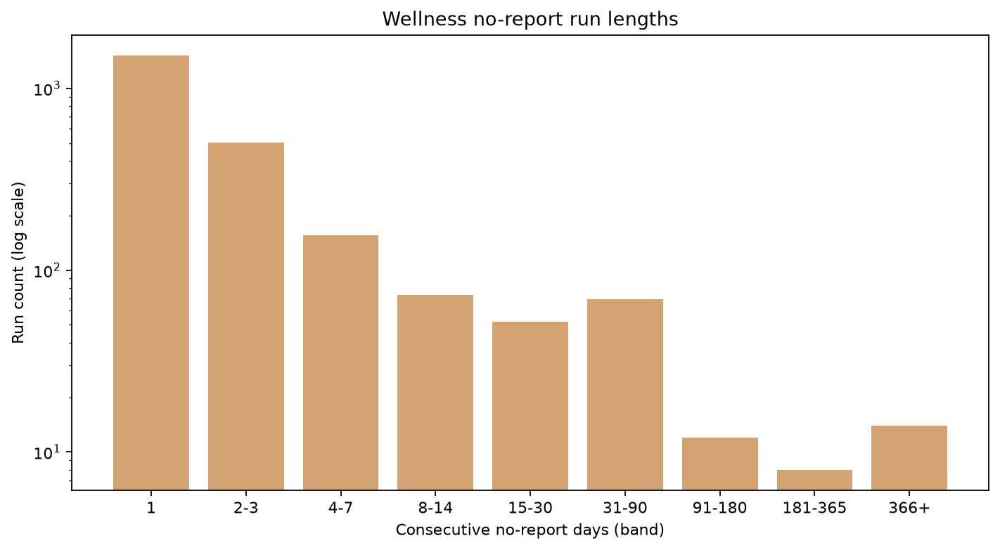
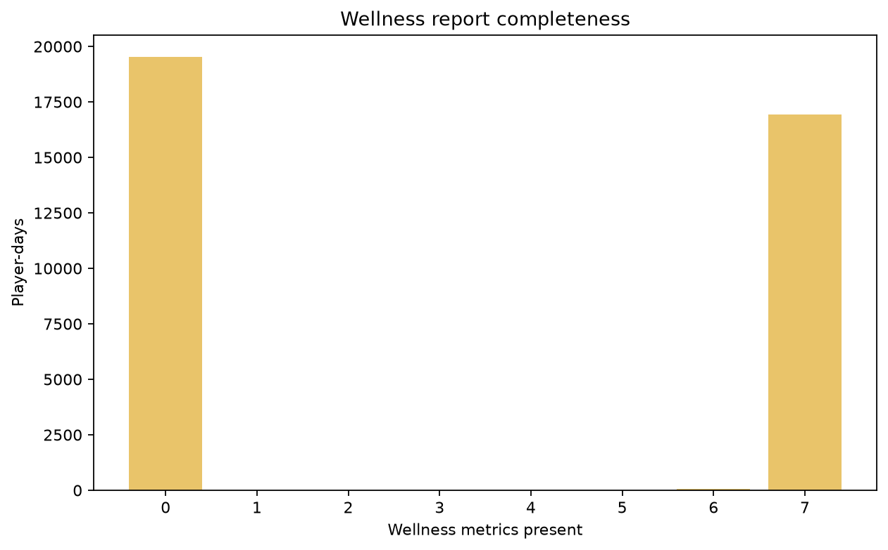
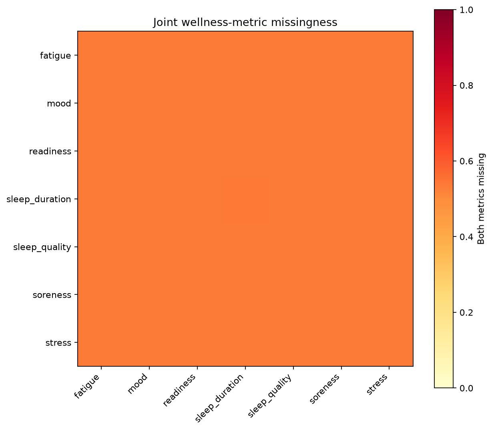
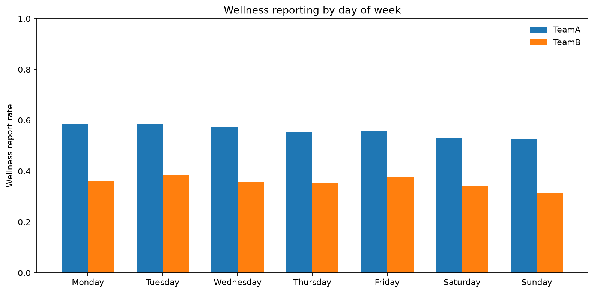
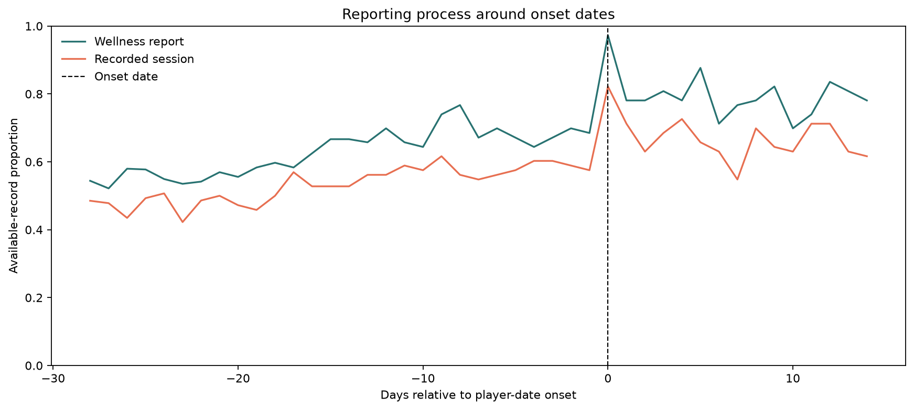

# Stage 2 - Missingness and Reporting-Process EDA

## Automated Status

Automated reporting-integrity result: **PASS**. Project-owner review is required before Stage 3.

## Scope

- Calendar player-days: `36550`.
- Wellness report days: `17008` (46.5%).
- Full wellness report days: `16931`; partial report days: `77`.
- Days with at least one recorded session: `14197`.
- Minimum training-load metric coverage: `100.0%`.

## Interpretation Boundaries

- Calendar presence, report submission and individual metric availability are separate concepts.
- No recorded session is not confirmed rest and is not automatically missing data.
- Zero is retained as an observed value; no source blank is converted to zero here.
- Event-centred patterns describe reporting process and are not predictive or causal.

## Player Coverage

Player wellness-report coverage ranges from `3.1%` to `88.4%`.

## Findings

| Check | Scope | Status | Message |
|---|---|---|---|
| wellness_presence_identity | silver wellness | PASS | 0 presence flags disagree with metric count |
| gold_completeness_reproduction | gold features | PASS | 0 fields differ from silver-derived values |
| player_reporting_variation | players | REVIEW | Player wellness coverage ranges from 3.1% to 88.4% |
| team_reporting_variation | teams | REVIEW | Team wellness coverage rates are [0.3556, 0.5588] |
| longest_no_report_run | wellness | REVIEW | Longest consecutive no-report run is 607 days |
| event_centered_reporting | onset context | REVIEW | Mean pre-onset wellness report rate is 62.9%; onset-day rate is 97.3%; this is descriptive process evidence only |
| session_absence_semantics | training sessions | REVIEW | No recorded session is not interpreted as confirmed rest or missing exposure |

## Figures

## Gate

Approve missing-value handling principles, reporting-indicator eligibility and any required cohort exclusions. No imputation or model-performance decision is made in this stage.
