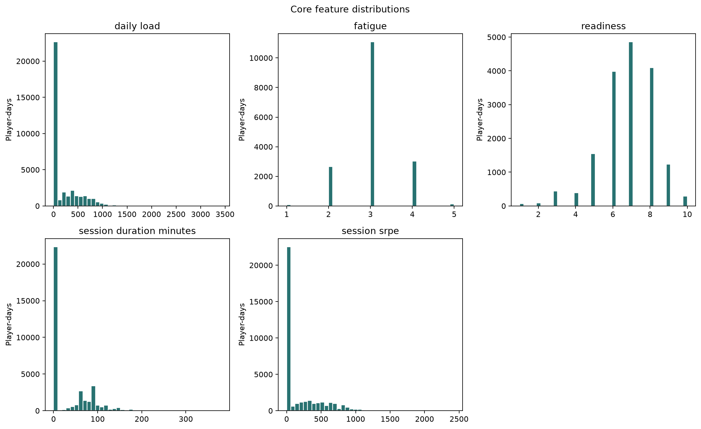
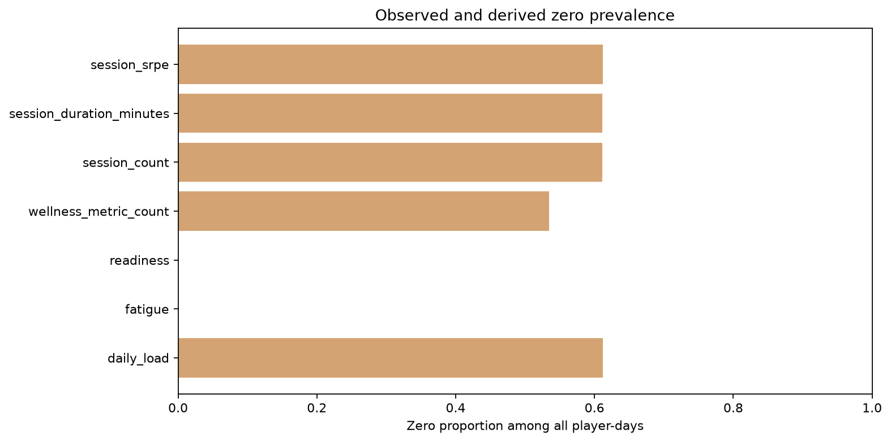
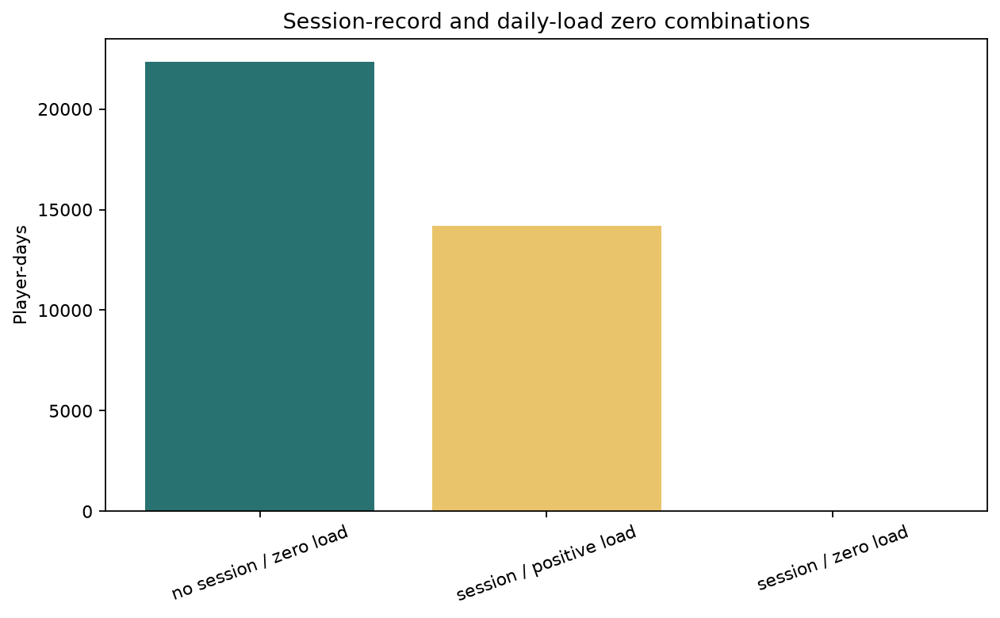
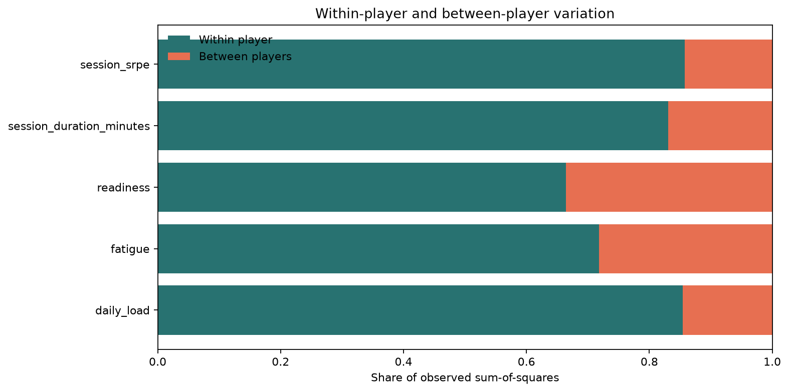
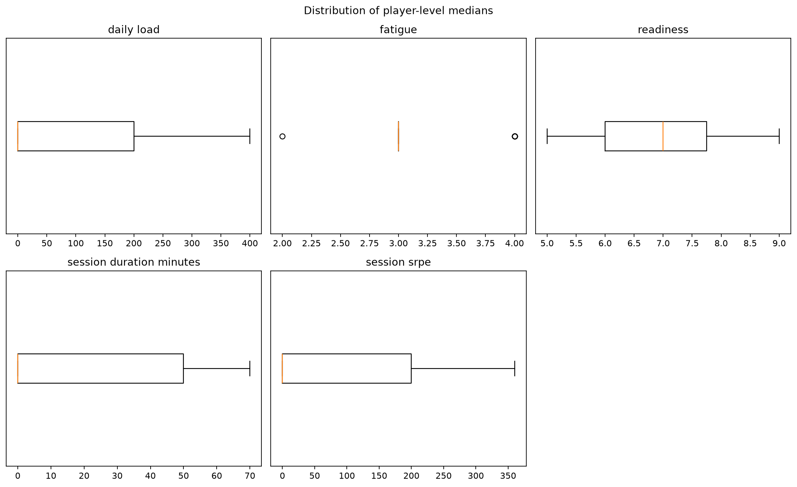
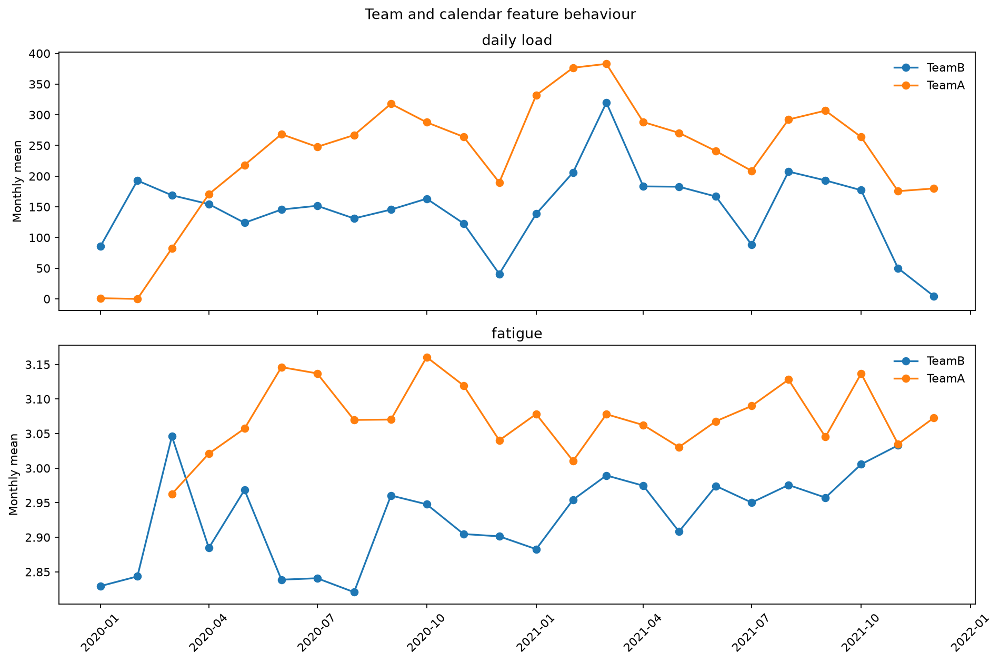
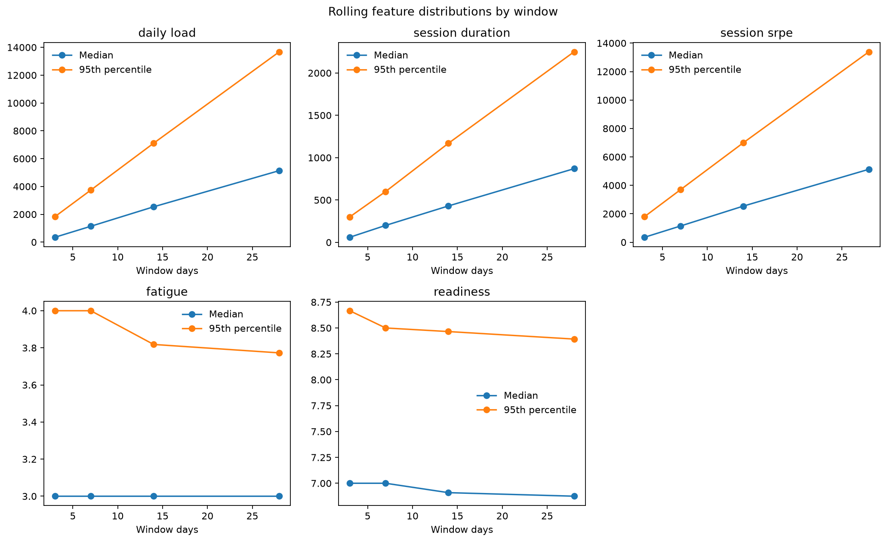
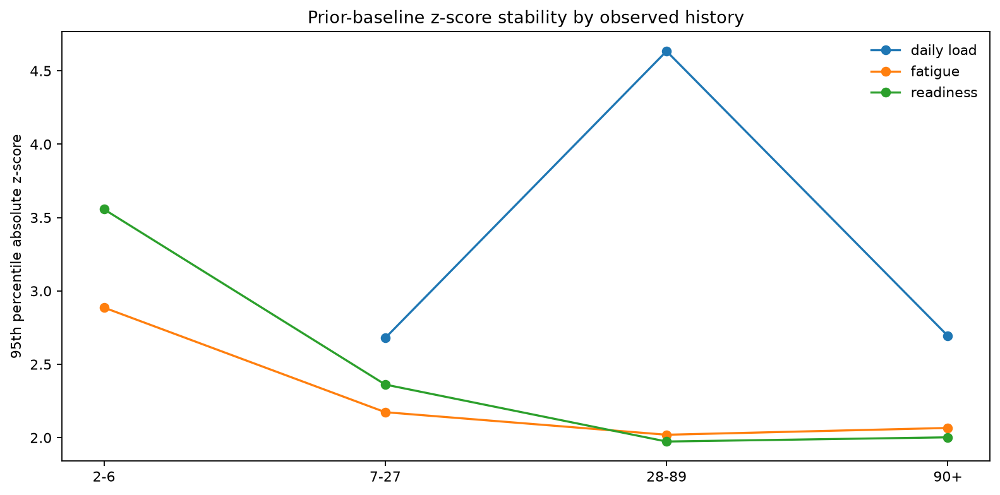
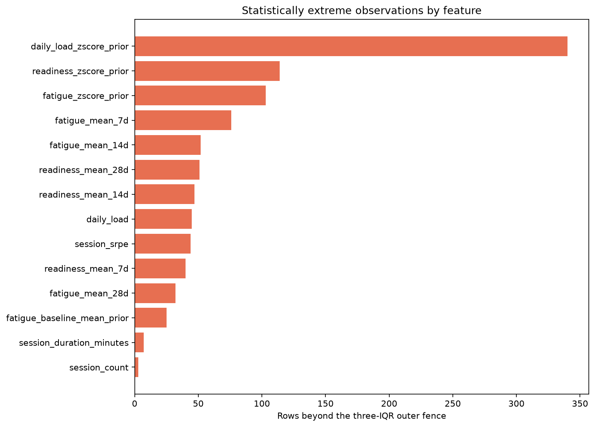

# Stage 3 - Feature Distribution and Temporal EDA

## Automated Status

Automated feature-integrity result: **PASS**. Project-owner review is required before Stage 4.

## Scope

- Player-days: `36550` across `50` players.
- Numeric features profiled: `33`.
- Review-only outlier rows retained: `250`.
- Statistical outer-fence crossings: `979`.

## Decision Boundaries

- Statistical extremeness alone does not justify correction or deletion.
- Missing values and observed zeros remain distinct.
- No recorded session is not interpreted as rest.
- Current wellness, current-inclusive wellness means and wellness z-scores are not primary-model eligible under DEC-031.
- No outcome association or model performance is analysed in this stage.

## Distribution Highlights

- Daily load median: `0.00`; 95th percentile: `810.00`; zero rate: `61.2%`.
- Largest between-player variation share: `readiness` at `33.5%`.

## Findings

| Check | Scope | Status | Message |
|---|---|---|---|
| feature_ranges | all numeric features | PASS | 0 finite, non-negative or bounded-count checks failed |
| rolling_integrity | rolling features | PASS | 0 rolling-window identities failed |
| load_zero_prevalence | daily load | REVIEW | Daily load is zero on 61.2% of player-days; zero is observed |
| wellness_baseline_maturity | fatigue prior baseline | REVIEW | Fatigue z-score availability in the 90+ observed-history band is 66.6% of calendar days and 100.0% when current fatigue is observed |
| zscore_tail_instability | prior-relative features | REVIEW | Maximum absolute z-scores are daily_load=80.6, fatigue=12.9, readiness=21.0; tiny prior variance can create unstable extremes |
| outlier_register | distribution tails | REVIEW | 979 rows cross outer fences; 250 highest-severity rows retained for review, capped at 20 per feature |
| same_day_wellness_boundary | feature eligibility | REVIEW | Current wellness, current-inclusive wellness means and wellness z-scores remain descriptive-only or require lagged reconstruction under DEC-031 |
| session_absence_boundary | session features | REVIEW | 22353 player-days have no recorded session; this is not confirmed rest |

## Figures

## Gate

Approve credible ranges, any justified transformations, reliable feature families and history thresholds for later cohort sensitivity. Stage 3 does not delete observations or choose features from outcome performance.
