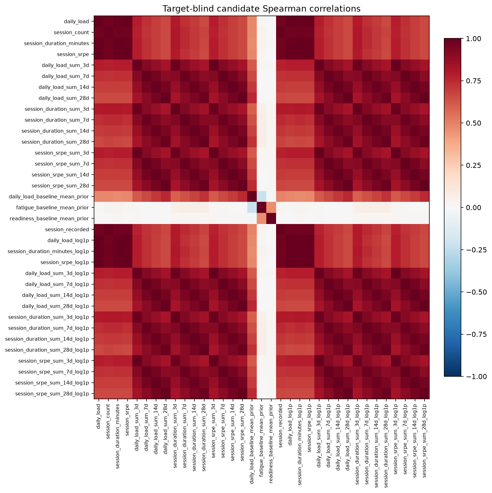
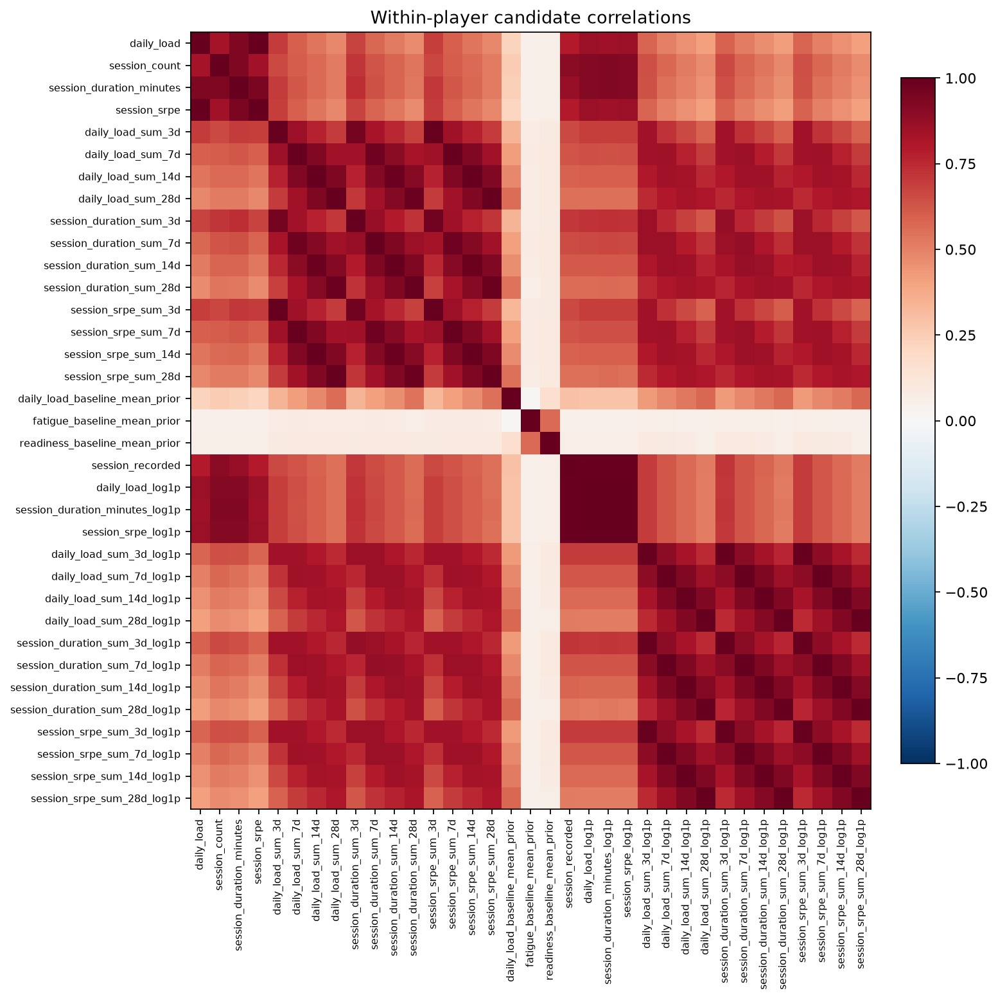
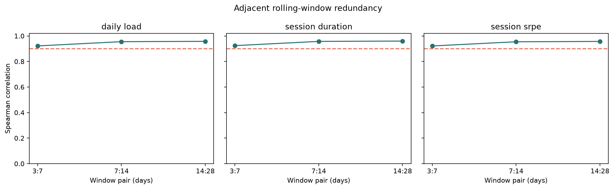
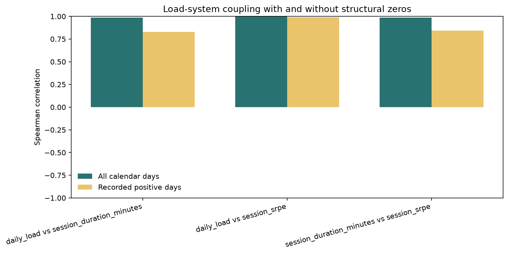
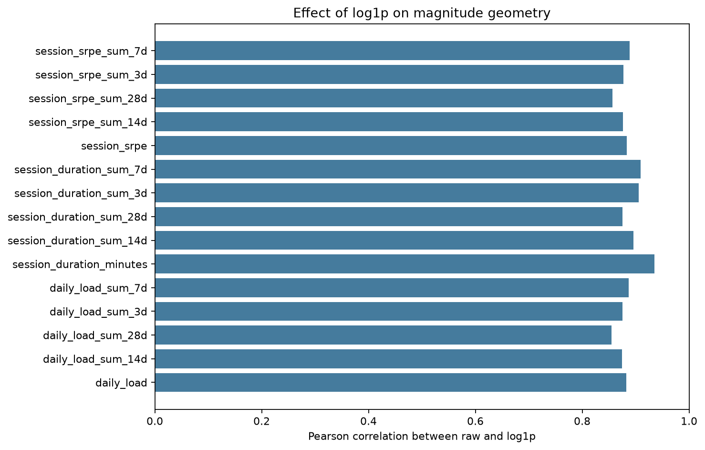
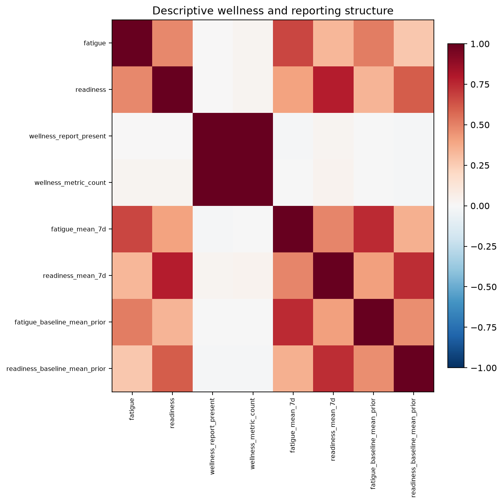
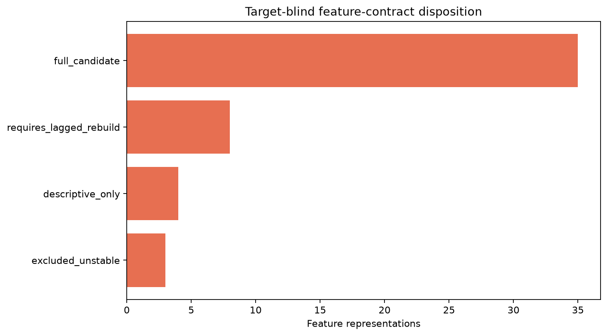

# Stage 4 - Feature Redundancy and Structural Relationships

## Automated Status

Automated structural-integrity result: **PASS**. Project-owner review is required before Stage 5.

## Scope

- Player-days: `36550` across `50` players.
- Source numeric features: `33`.
- Derived target-blind candidates: `16`.
- Full-contract candidates: `35`.
- Outcome columns used: `0`.

## Decision Boundaries

- Correlation and deterministic structure do not establish predictive value.
- High correlation does not automatically remove a feature; it identifies alternatives.
- Same-day/current-inclusive wellness remains outside the primary contract under DEC-031.
- Existing z-scores remain excluded under DEC-032.
- Raw source values and all player-days remain unchanged.

## Structural Highlights

- `221` pairs cross the absolute Spearman threshold of `0.90`.
- `36` pairs cross the near-deterministic threshold of `0.995`.
- Strongest positive-recorded-day load coupling: `daily_load vs session_srpe` at Spearman `0.989`.

## Findings

| Check | Scope | Status | Message |
|---|---|---|---|
| outcome_isolation | analysis frame | PASS | 0 prohibited outcome-like columns entered the analysis frame |
| transform_integrity | log1p candidates | PASS | 0 transformation checks failed |
| correlation_bounds | correlation register | PASS | 0 coefficients fall outside [-1, 1] |
| candidate_variation | full candidate contract | PASS | 0 candidates are constant or empty |
| high_correlation_review | candidate representations | REVIEW | 221 feature pairs have absolute Spearman correlation at least 0.90 |
| near_deterministic_review | candidate representations | REVIEW | 36 pairs reach the near-deterministic threshold; expected raw/log pairs remain alternatives, not independent evidence |
| load_coupling_review | load system | REVIEW | Strongest positive-recorded-day coupling is daily_load vs session_srpe at Spearman 0.989 |
| same_day_wellness_boundary | wellness features | PASS | Same-day and current-inclusive wellness fields are absent from the full candidate contract |
| source_preservation | canonical features | PASS | Stage 4 adds target-blind representations without dropping player-days or modifying source values |

## Figures

## Gate

Approve or revise the full candidate contract and the smaller operational feature-family proposal. Stage 4 does not use outcomes or model performance.
