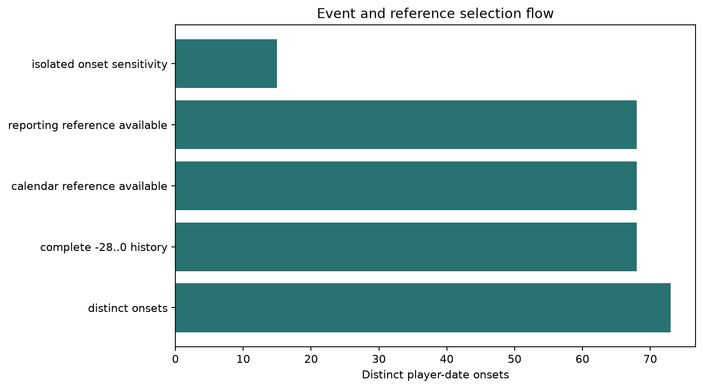
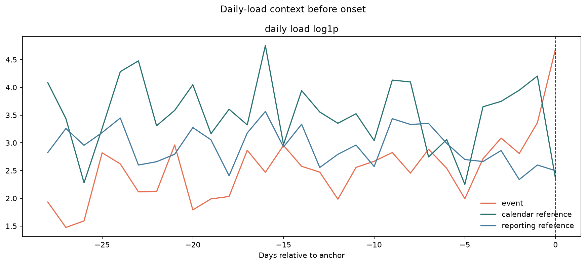
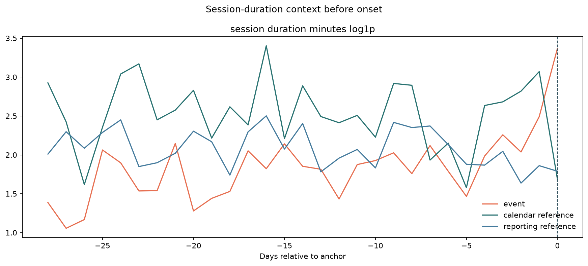
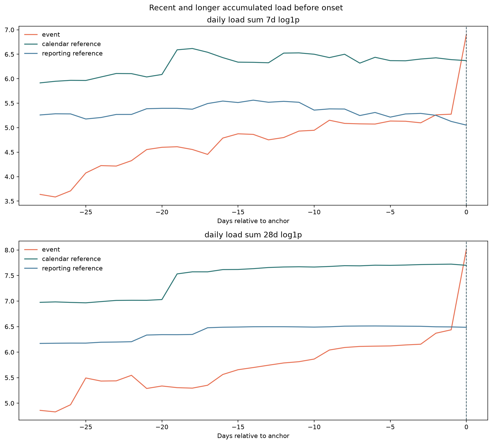
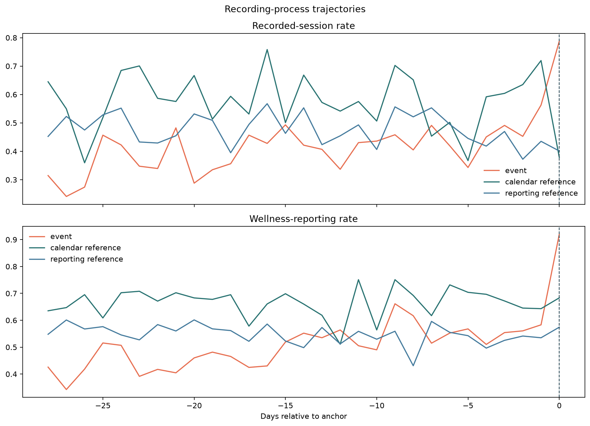
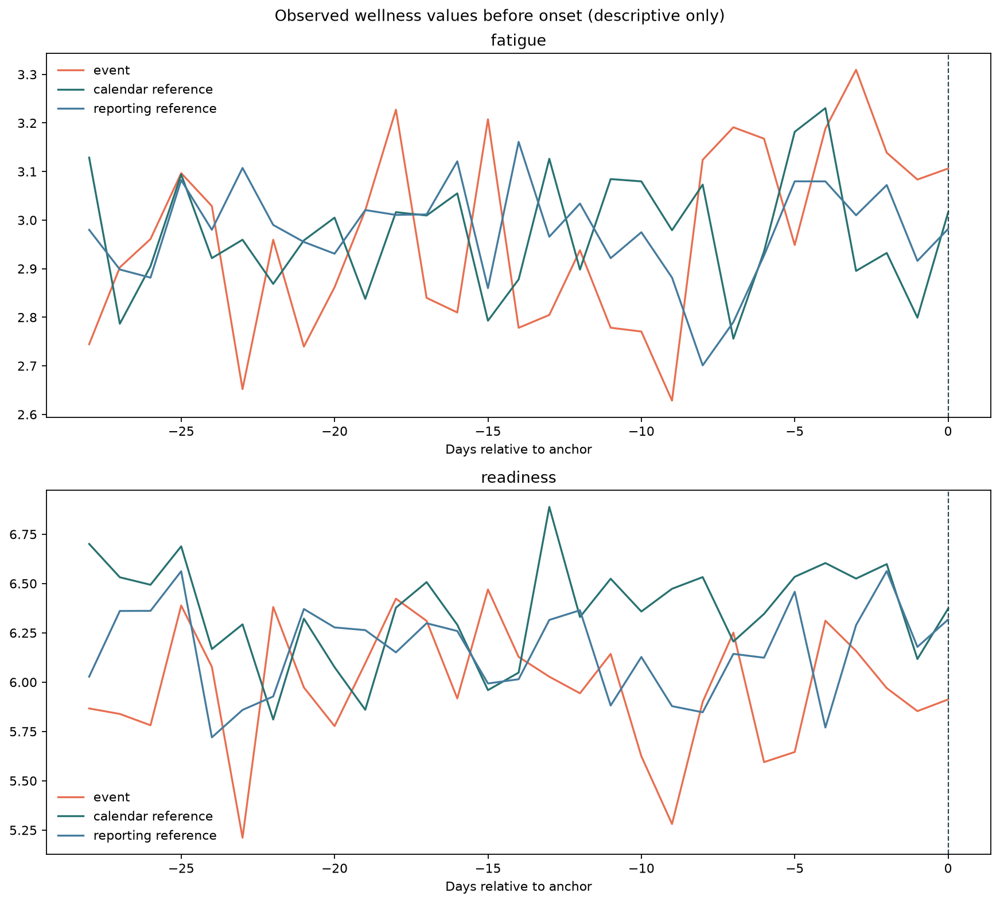
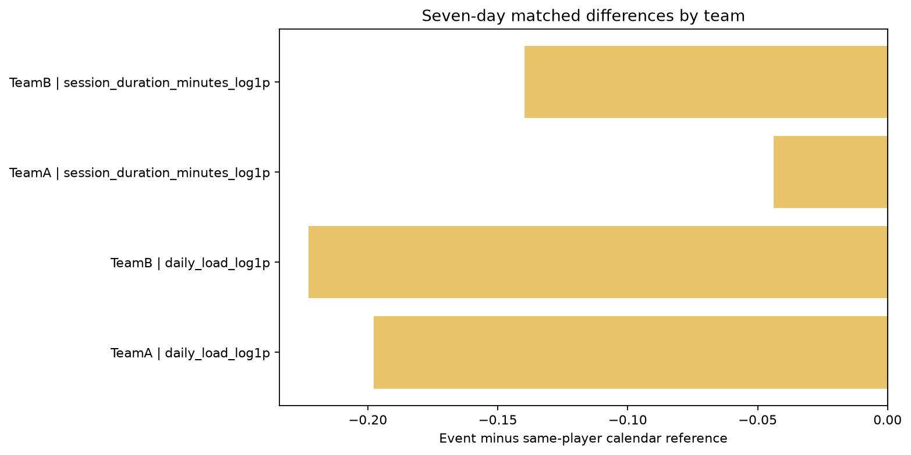
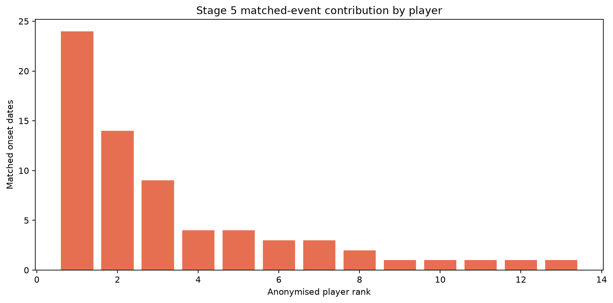
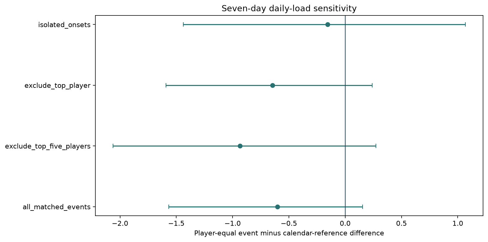

# Stage 5 - Descriptive Outcome-Context Analysis

## Automated Status

Automated context-integrity result: **PASS**. Project-owner review is required before Stage 6.

## Scope

- Distinct player-date onsets: `73`.
- Onsets with complete -28 through day-0 history: `68`.
- Onsets with clean same-player calendar references: `68`.
- Isolated onset sensitivity events: `15`.
- Context features: `12`.
- Predictive models fitted: `0`.

## Interpretation Boundaries

- Primary summaries use relative days -28 through -1; day 0 is shown separately.
- Same-day wellness and reporting remain descriptive-only under DEC-031.
- No-session remains unknown recording/exposure state, not confirmed rest.
- Matched differences are retrospective descriptions, not predictive, causal or medical evidence.
- Player-cluster bootstrap intervals reflect player concentration but do not solve limited support.

## Findings

| Check | Scope | Status | Message |
|---|---|---|---|
| predictive_label_isolation | analysis frame | PASS | 0 fixed-horizon label columns entered feature measurement |
| distinct_onset_index | event register | PASS | 0 duplicate player-date onsets remain |
| relative_day_identity | event/reference timeline | PASS | 0 relative-day rows have inconsistent dates |
| day_zero_exclusion | primary pre-onset summaries | PASS | 0 day-zero/post-anchor rows entered the primary flag |
| reference_availability | same-player references | PASS | 68 of 68 complete-history onsets have clean calendar references |
| overlapping_event_windows | event context | REVIEW | 53 complete-history onsets have another onset within plus/minus 28 days; isolated sensitivity is retained |
| player_concentration | matched descriptive evidence | REVIEW | Top five players contribute 80.9% of matched onset dates; player-equal and exclusion sensitivities are required |
| reporting_process_boundary | wellness context | REVIEW | 544 event-level reporting differences are descriptive-only under DEC-031 |
| non_predictive_boundary | Stage 5 interpretation | PASS | No model, discrimination metric, feature selection or causal test is performed |

## Figures

## Gate

Decide which descriptive patterns merit later prospective testing. Stage 5 evidence must not silently expand the operational feature contract or support causal claims.
