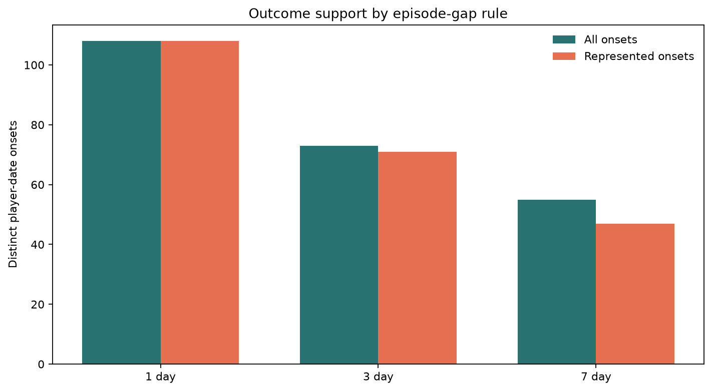
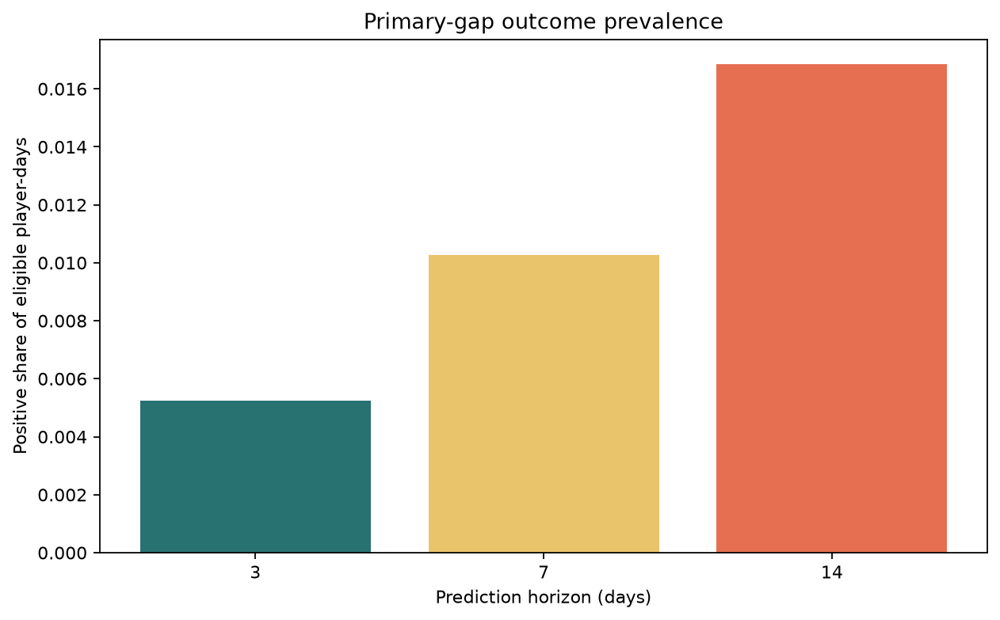
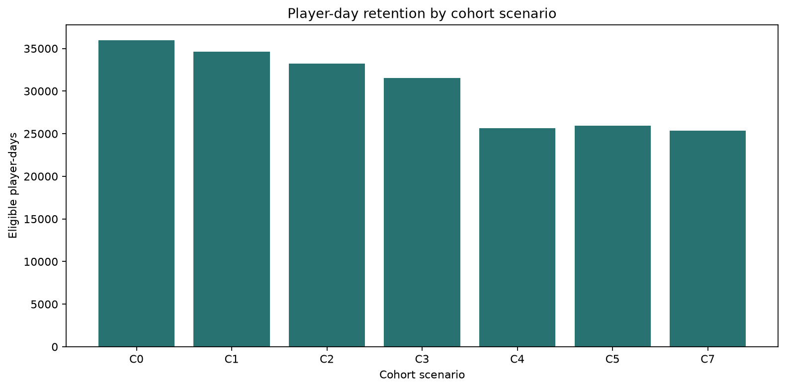
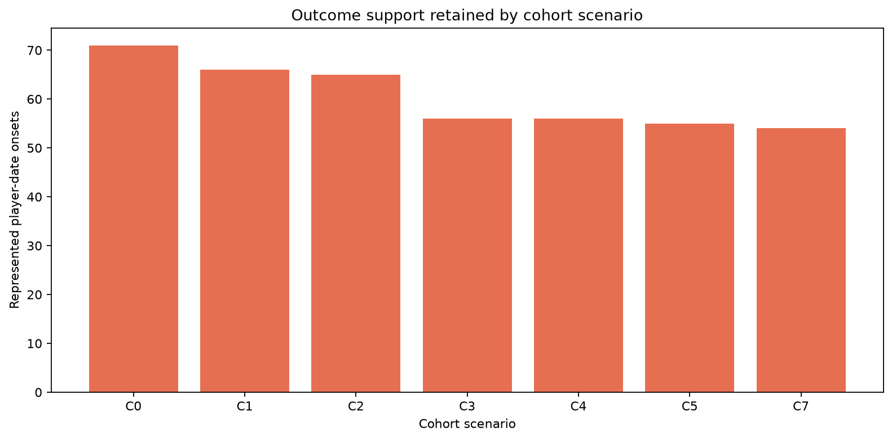
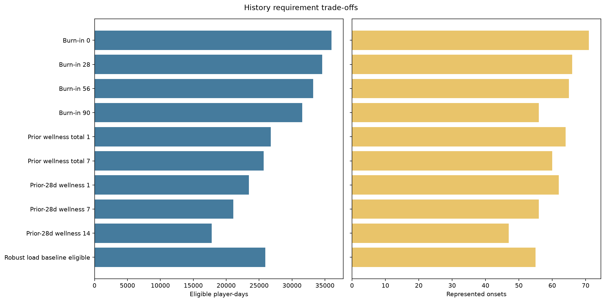
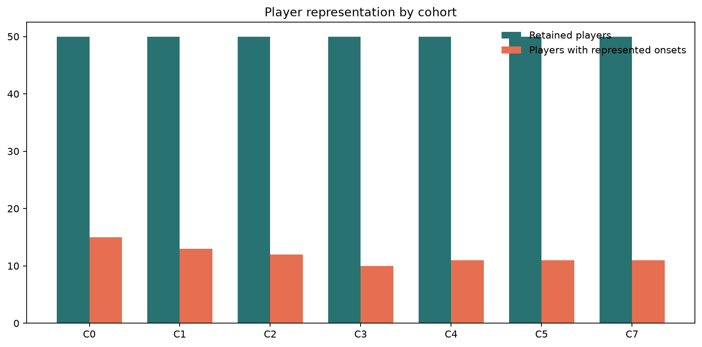
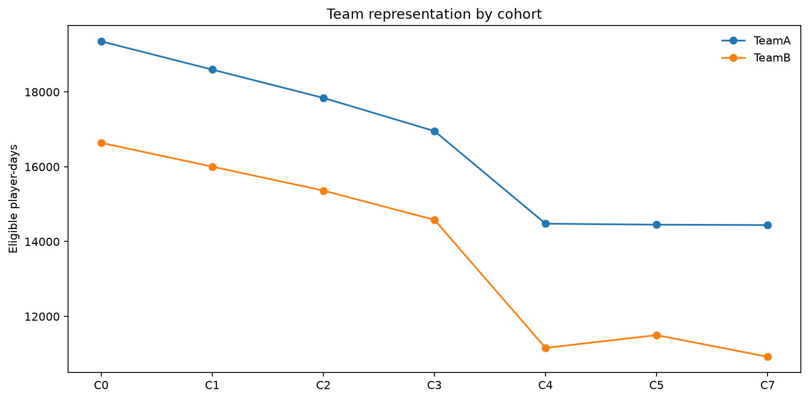
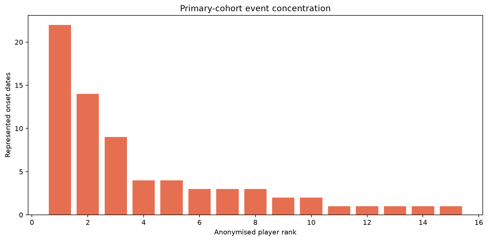
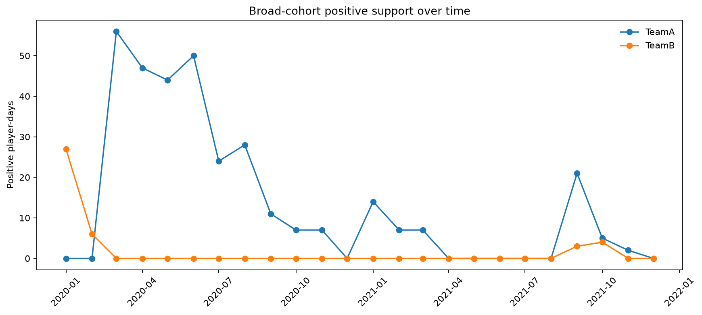

# Stage 6 - Cohort and Outcome Sensitivity Analysis

## Automated Status

Automated integrity result: **PASS**. Project-owner review is required before any cohort or outcome rule is frozen.

## Scope

- Source player-days: `36550` across `50` players.
- Episode-gap rules: `3`; prediction horizons: `3`.
- Registered scenarios: `8`.
- Broad primary-candidate support: `35992` eligible days, `370` positive days and `71` represented onsets.
- Predictive models fitted: `0`; splits created: `0`.

## Interpretation Boundaries

- All history requirements use information strictly before the prediction date.
- Isolated-onset status is an outcome-support sensitivity, never a prospective cohort filter.
- Scenario comparisons quantify support and representation; they do not optimise model performance.
- Candidate recommendations remain provisional until project-owner results approval.

## Findings

| Check | Scope | Status | Message |
|---|---|---|---|
| primary_label_reproduction | 3-day episode rule | PASS | 0 field mismatches across 36550 rebuilt player-days |
| horizon_nesting | all gap rules | PASS | 0 nested-label violations |
| gap_support_order | episode sensitivity | PASS | Distinct onset support by 1/3/7-day gap is [108, 73, 55] |
| burn_in_nesting | cohort scenarios | PASS | 0/28/56/90-day burn-in cohorts are monotonically nested |
| future_outcome_cohort_isolation | isolated-onset sensitivity | PASS | Isolated-onset status is not used as a prospective player-day eligibility filter |
| event_concentration | primary candidate cohort | REVIEW | Top five players contribute 74.6% of represented onsets |
| combined_history_attrition | history-sensitive cohort | REVIEW | Combined history retains 70.5% of broad eligible days and 54 represented onsets |
| non_modelling_boundary | Stage 6 | PASS | No model, split, feature ranking or discrimination metric is produced |

## Provisional Decision Candidates

| Dimension | Provisional primary | Required secondary | Status |
|---|---|---|---|
| episode gap | 3 days | 1 and 7 days | REVIEW |
| prediction horizon | 7 days | 3 and 14 days | REVIEW |
| burn-in | 28 prior calendar days | 0, 56 and 90 days | REVIEW |
| wellness history | no exclusion | at least 7 strictly prior reports | REVIEW |
| player baseline | not required for cohort entry | robust-load-baseline eligible subset | REVIEW |

## Figures

## Gate

Approve or revise the primary episode gap, prediction horizon, cohort eligibility, history requirements and mandatory secondary sensitivities before Stage 7.
