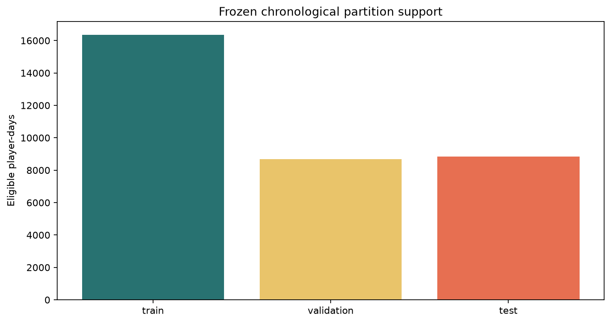
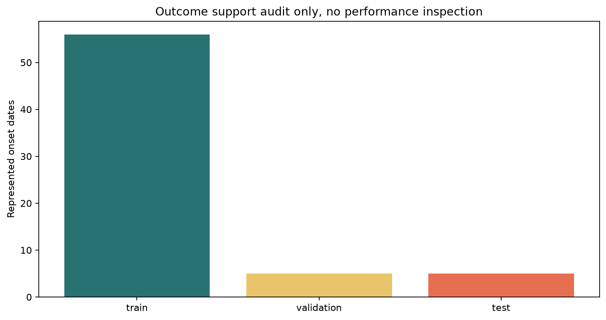
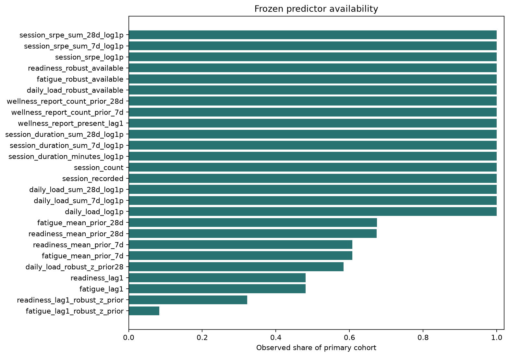
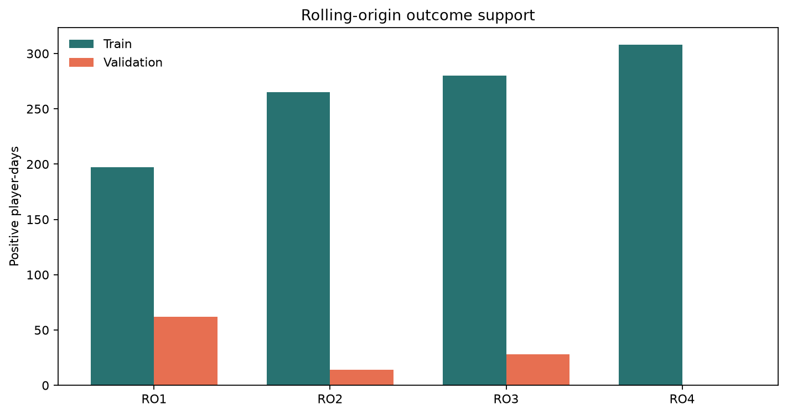
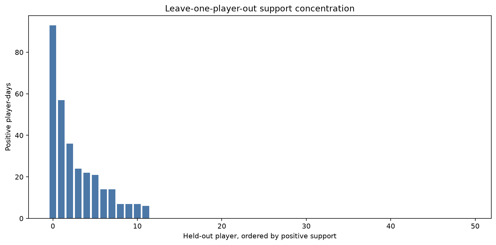
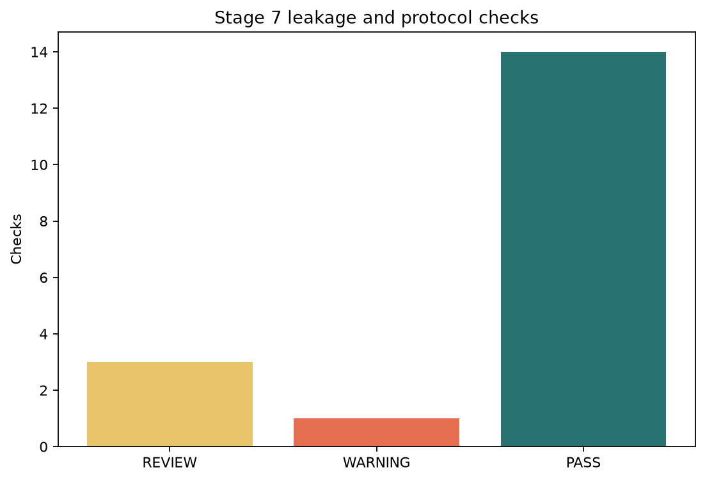

# Stage 7 - Prospective Protocol and Leakage Audit

## Automated Status

Protocol audit: **PASS** with `0` failures, `1` warnings and `3` review findings.

This stage freezes evaluation rules. It fits no model, creates no predictions, selects no threshold and inspects no final-test performance.

## Frozen Primary Contract

- Three-day episode gap and seven-day future onset target.
- Twenty-eight strictly prior calendar-day burn-in.
- Complete target horizon and exclusion while inside an active episode.
- Same-day wellness, identities, outcomes and future/follow-up fields are prohibited.
- Missingness and robust-baseline availability remain explicit; neither restricts cohort entry.

## Chronological Support

| Partition | Dates | Player-days | Positive days | Represented onsets | Event players |
|---|---|---:|---:|---:|---:|
| train | 2020-01-29 to 2020-12-24 | 16365 | 280 | 56 | 12 |
| validation | 2021-01-01 to 2021-06-23 | 8690 | 28 | 5 | 3 |
| test | 2021-07-01 to 2021-12-24 | 8845 | 35 | 5 | 4 |

Seven-day embargoes separate train from validation and validation from test. The final test partition is locked after this support audit.

## Leakage Findings

| Check | Status | Evidence |
|---|---|---|
| player_date_uniqueness | PASS | 0 duplicate keys |
| forbidden_predictor_exclusion | PASS | forbidden allow-list overlap: [] |
| same_day_wellness_exclusion | PASS | same-day wellness predictors: [] |
| predictor_materialisation | PASS | missing predictors: [] |
| primary_cohort_reproduction | PASS | expected 34600, observed 34600 |
| partition_and_embargo_accounting | PASS | 33900 assigned, 700 embargoed, 0 unexplained |
| seven_day_embargo | PASS | target windows end before the next partition starts |
| future_append_invariance | PASS | 27350 earlier rows unchanged after future append |
| strictly_prior_wellness | PASS | 0 lag mismatches |
| preprocessing_fit_scope | PASS | all learned preprocessing is restricted to development partitions |
| final_test_lock | PASS | support only; no prediction or performance metric exists |
| prohibition_register | PASS | 7 prohibition groups documented |
| partition_event_support | PASS | 0 partitions have no represented onsets |
| sparse_partition_support | REVIEW | 2 partitions have fewer than 10 represented onsets |
| rolling_origin_positive_support | WARNING | 1 validation folds have zero positive player-days |
| unseen_player_positive_support | REVIEW | 38 held-out players have zero positive development days |
| low_coverage_predictors | REVIEW | 1 allowed predictors have less than 20% primary-cohort coverage |
| model_free_stage | PASS | zero fitted models, predictions, thresholds or performance estimates |

## Figures

## Gate

Project-owner review is required. Stage 8 may consolidate readiness only after this protocol and its leakage evidence are approved. Modelling remains prohibited.
