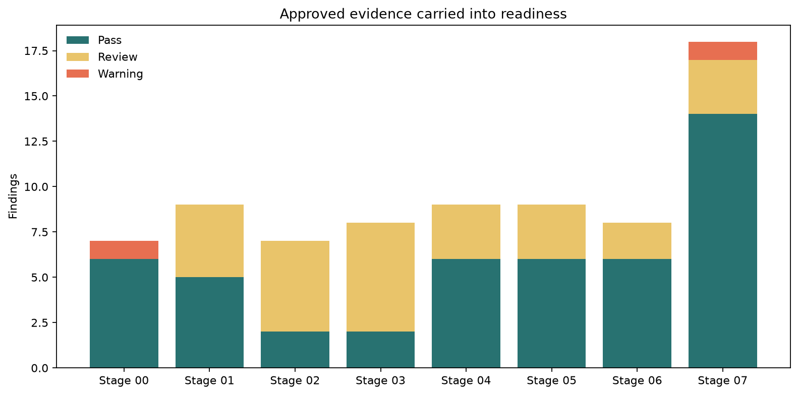
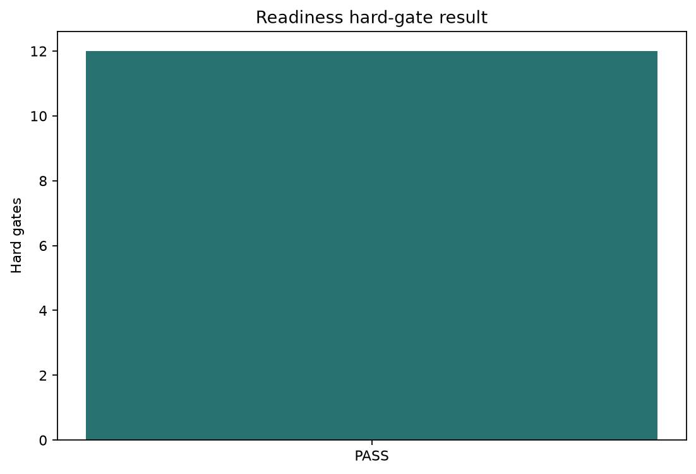
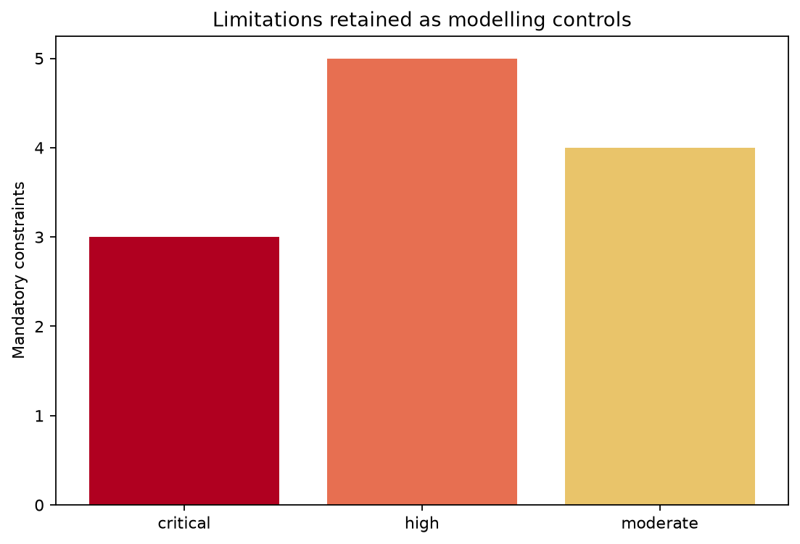
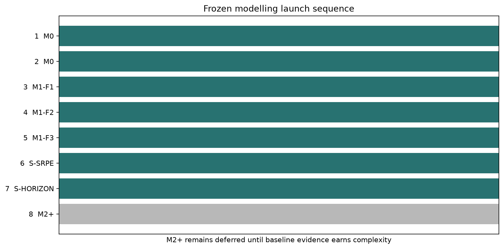

# Stage 8 - Pre-Model Readiness Report

## Provisional Recommendation

# READY

Scope: **Narrow exploratory M0/M1 subjective-data baseline programme**.

This recommendation does not itself authorise modelling. Separate project-owner approval is required. No model, prediction, threshold, performance metric or final-test performance was produced in Stage 8.

## Decision Basis

- Hard gates passed: `12`; failed: `0`.
- Mandatory modelling and claim constraints: `12`.
- Source stages consolidated: `8`.
- Readiness is binary by hard gate; passing checks are not averaged into a score.

## Hard Gates

| Gate | Domain | Status | Evidence | Constraint |
|---|---|---|---|---|
| G01 | evidence completeness | PASS | 8/8 stage manifests loaded with findings and reports | none |
| G02 | stage integrity | PASS | all Stage 0-7 manifests PASS and no findings register contains FAIL | none |
| G03 | outcome validity | PASS | episode and primary player-day labels reproduce exactly | none |
| G04 | missingness semantics | PASS | wellness presence and gold completeness fields reconcile; missingness is explicit | required |
| G05 | feature integrity | PASS | numeric ranges pass and target-blind feature analysis used no outcomes | required |
| G06 | cohort and split contract | PASS | primary cohort reproduces and train/validation/test support is retained | none |
| G07 | leakage prevention | PASS | Stage 7 has zero leakage or protocol failures | none |
| G08 | final-test governance | PASS | final-test support only; no performance inspection recorded | required |
| G09 | pre-model isolation | PASS | Stages 5-7 contain zero fitted models | none |
| G10 | exploratory outcome support | PASS | all partitions have represented onsets; minimum partition support is 5 | required |
| G11 | prospective protocol completeness | PASS | 6 frozen protocol tables present | none |
| G12 | reproducibility | PASS | all eight notebooks are output-free and poetry.lock is present | none |

## Mandatory Limitations and Controls

| ID | Severity | Limitation evidence | Mandatory control |
|---|---|---|---|
| L01 | critical | SoccerMon subjective data and self-reported outcomes do not establish medical validity | Limit all modelling and reporting to exploratory practitioner-review decision support |
| L02 | high | Validation and test represent 5 and 5 onsets | Always disclose onset/player counts and wide uncertainty; avoid precise comparative claims |
| L03 | high | 1 rolling validation window has zero positive player-days | Use that window as a stress period only, not for discrimination or calibration estimation |
| L04 | high | 38/50 held-out players have zero positive development days | Aggregate support-aware stress results; never average undefined player-level metrics |
| L05 | high | Only 73 primary player-date onsets exist | Use player-cluster and temporal-block uncertainty and disclose concentration |
| L06 | high | Outcome is self-reported recorded onset, not confirmed tissue injury or availability loss | Use model-estimated availability-risk and review language; prohibit diagnosis/clearance claims |
| L07 | moderate | Wellness coverage and reporting process vary by player, team and proximity to onset | Use lagged values, missing indicators, train-only imputation and missingness sensitivity |
| L08 | moderate | Robust fatigue coverage is 8.4% | Keep F3 incremental/secondary and report availability alongside any result |
| L09 | moderate | Daily load and session sRPE are near duplicates | Use sRPE only as a replacement sensitivity, never alongside daily load |
| L10 | critical | Final test is small and currently uninspected | Access once only after feature, model, calibration and alert rules are frozen |
| L11 | moderate | Episode gap and 3/14-day horizons change support and positive-row dependence | Run pre-specified horizon/gap sensitivities without selecting a convenient winner |
| L12 | critical | No prospective club deployment, external team transfer or clinical validation exists | Do not claim operational deployment readiness, team transfer or medical utility |

## Permitted Interpretation

A `READY` recommendation permits only a narrow exploratory M0/M1 programme using subjective SoccerMon data. It does not establish medical validity, operational deployment readiness, causal effects, player clearance, team transfer or prospective club utility.

## Figures

## Owner Gate

The project owner must approve exactly one decision: `READY`, `REVISE` or `DO NOT MODEL`. Until that decision is recorded, modelling and final-test performance access remain prohibited.
